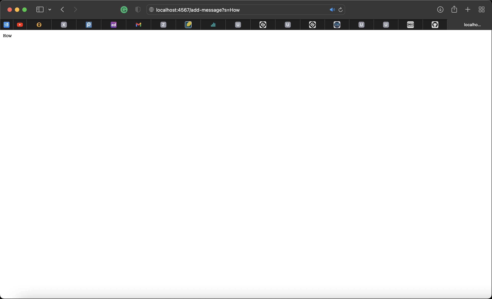
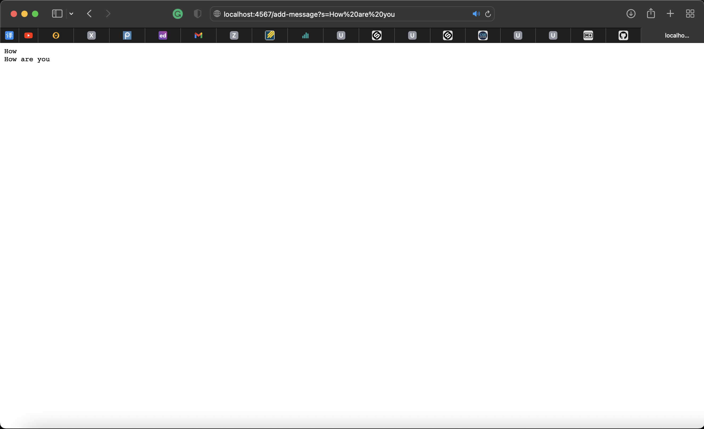
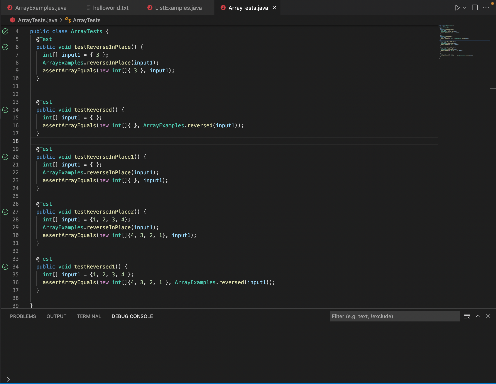
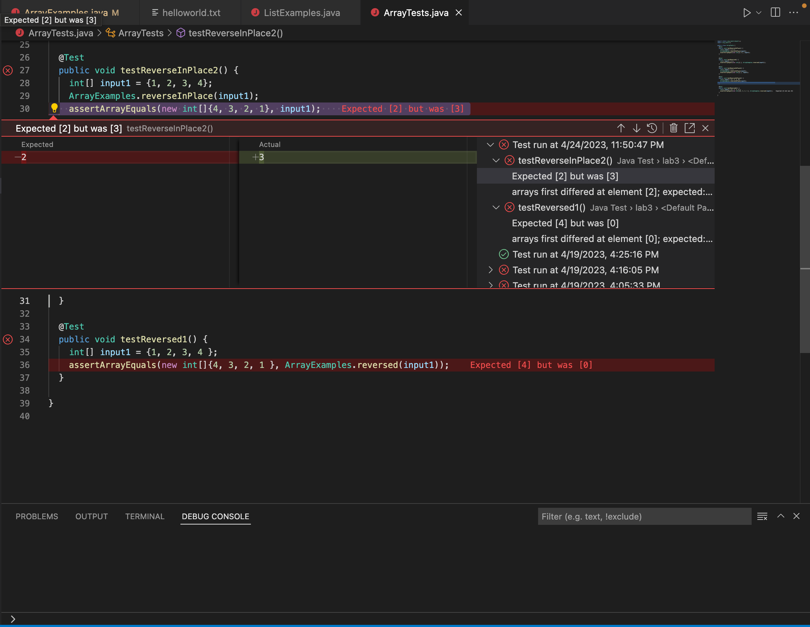

# Lab Report 2
## This lab report will contain three parts:
* String Server(unfinished)
* Bugs and Debugging
* Reflection on Learning

## Part 1: String Server(unfinished)
The code for StringServer.java and Server.java is shown below:
1. StringServer.java
```
import java.io.IOException;
import java.net.URI;
import java.nio.file.Files;
import java.nio.file.Paths;
import java.util.List;

class StringHandler implements URLHandler {
  List<String> lines;
  String path;
  StringHandler(String path) throws IOException {
    this.path = path;
    this.lines = Files.readAllLines(Paths.get(path));
  }
  public String handleRequest(URI url) throws IOException {
    String query = url.getQuery();
    if(url.getPath().equals("/add-message")) {
      if(query.startsWith("s=")) {
        String toAdd = query.split("=")[1];
        this.lines.add(toAdd);
        return String.format("%s added, there are now %s lines\n", toAdd, this.lines.size());
      }
      else {
        return "/add-message requires a query parameter s\n";
      }
    }else {
      return String.join("\n", lines) + "\n";
    }
  }
}

class StringServer {
  public static void main(String[] args) throws IOException {
    if(args.length == 0){
      System.out.println("Missing port number! Try any number between 1024 to 49151");
      return;
    }
    if(args.length == 1){
      System.out.println("Missing file path! Give a path to a text file as the second argument.");
      return;
    }

    int port = Integer.parseInt(args[0]);

    Server.start(port, new StringHandler(args[1]));
  }
}
```
2. Server.java
```
// A simple web server using Java's built-in HttpServer

// Examples from https://dzone.com/articles/simple-http-server-in-java were useful references

import java.io.IOException;
import java.io.OutputStream;
import java.net.InetSocketAddress;
import java.net.InetAddress;
import java.net.URI;

import com.sun.net.httpserver.HttpExchange;
import com.sun.net.httpserver.HttpHandler;
import com.sun.net.httpserver.HttpServer;

interface URLHandler {
    String handleRequest(URI url) throws Exception;
}

class ServerHttpHandler implements HttpHandler {
    URLHandler handler;
    ServerHttpHandler(URLHandler handler) {
      this.handler = handler;
    }
    public void handle(final HttpExchange exchange) throws IOException {
        // form return body after being handled by program
        try {
            String ret = handler.handleRequest(exchange.getRequestURI());
            // form the return string and write it on the browser
            exchange.sendResponseHeaders(200, ret.getBytes().length);
            OutputStream os = exchange.getResponseBody();
            os.write(ret.getBytes());
            os.close();
        } catch(Exception e) {
            String response = e.toString();
            exchange.sendResponseHeaders(500, response.getBytes().length);
            OutputStream os = exchange.getResponseBody();
            os.write(response.getBytes());
            os.close();
        }
    }
}

public class Server {
    public static void start(int port, URLHandler handler) throws IOException {
        HttpServer server = HttpServer.create(new InetSocketAddress(port), 0);

        //create request entrypoint
        server.createContext("/", new ServerHttpHandler(handler));

        //start the server
        server.start();
        System.out.println("Server started at http://" + InetAddress.getLocalHost().getHostName() + ":" + port);
        System.out.println("(Or, if it's running locally on this computer, use http://localhost:" + port + " )");
    }
}
```
Below, I'll display 2 examples of calling the `add-message` method using `/add-message?s=<string>` query in the URL:
1. `/add-message?s=How`, then the webpage should have the argument "How" on the path local host home page. The field toAdd in the java file should equal to "How" as well. The code `String query = url.getQuery()` will get the full query from the URL and store it. Then `if(url.getPath().equals("/add-message"))` will find out if the query has `/add-message`, if so `String toAdd = query.split("=")[1]` will take everything after "=" as the message to be added. `this.lines.add(toAdd)` will do the add-message function for the webpage we are testing one.


2. `/add-message?s=How%20are%20you`, then the webpage should have the argument "How are you" as the line after "How" on the path local host home page. The field toAdd in the java file should equal to "How are you" as well. The code `String query = url.getQuery()` will get the full query from the URL and store it. Then `if(url.getPath().equals("/add-message"))` will find out if the query has `/add-message`, if so `String toAdd = query.split("=")[1]` will take everything after "=" as the message to be added. `this.lines.add(toAdd)` will do the add-message function for the webpage we are testing one.(sorry I only know that "%20" can be the parameter equal to a space.)


## Part 2: Bugs and Debugging
In week 3, we debuged a program and I'll display some of my results below.(for `ArrayExamples.java` and `ArrayTests.java`)
1. A failure-inducing input for the buggy program
```
static void reverseInPlace(int[] arr) {
    for(int i = 0; i < arr.length; i += 1) {
      arr[i] = arr[arr.length - i - 1];
    }
  }
```
2. An input that doesn’t induce a failure
```
@Test 
	public void testReverseInPlace() {
    int[] input1 = { 3 };
    ArrayExamples.reverseInPlace(input1);
    assertArrayEquals(new int[]{ 3 }, input1);
	}
```
This input doesn't induce a failure because it only contains one element in the array, and the `testReverserInPlace()` won't process the array in a wrong way if it only contains an empty array or an array with only one element.


3. The symptom, as the output of running the tests is shown as the image below. The symptom is that `testReverserInPlace()` is having output `3` where expected `2` and having output `0` where expected `4`. This pattern may be caused by the for-loop failed to store the Reversed value.


4. The bug, as the before-and-after code change required to fix it:

Before
```
static void reverseInPlace(int[] arr) {
    for(int i = 0; i < arr.length; i += 1) {
      arr[i] = arr[arr.length - i - 1];
    }
  }
```
After
```
  static void reverseInPlace(int[] arr) {
    int temp;
    for(int i = 0; i < arr.length/2; i += 1) {
      temp = arr[i];
      arr[i] = arr[arr.length - i - 1];
      arr[arr.length - i - 1] = temp;
    }
  }
```
The changes allows the for-loop to loop through 1/2 length of the loop so that the loop won't double reverse the array(which makes no changes)
The changes also allow the index to be saved by temp so it won't be lost while swapping.

## Part 3
In lab 2, I learned that the port number can be any random large number that is not in use, and to access the CSE lab computers on my own laptop, I should have my laptop connected to UCSD Protected, then I can have the access to the localhost test page.

In lab 3, I learned that if I can't see where the bug is by just looking at the code, I can write out the process of how the code works step by step, then see how the code led to a wrong or unexptected output.(Our tutor helped me out on the thinking process, thanks!)
